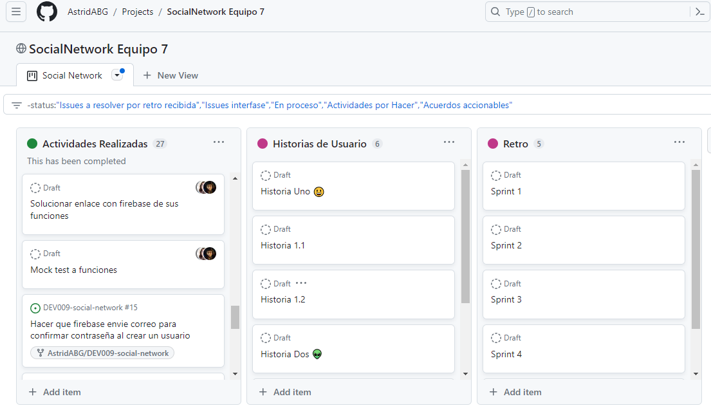
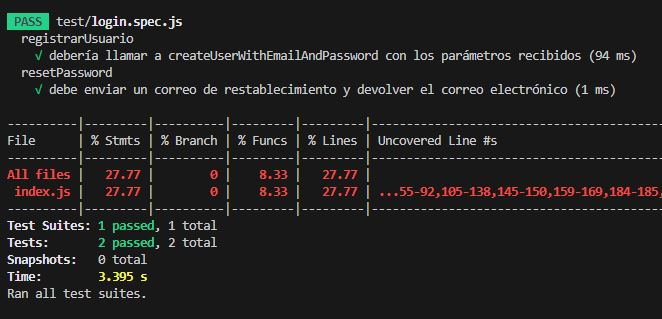
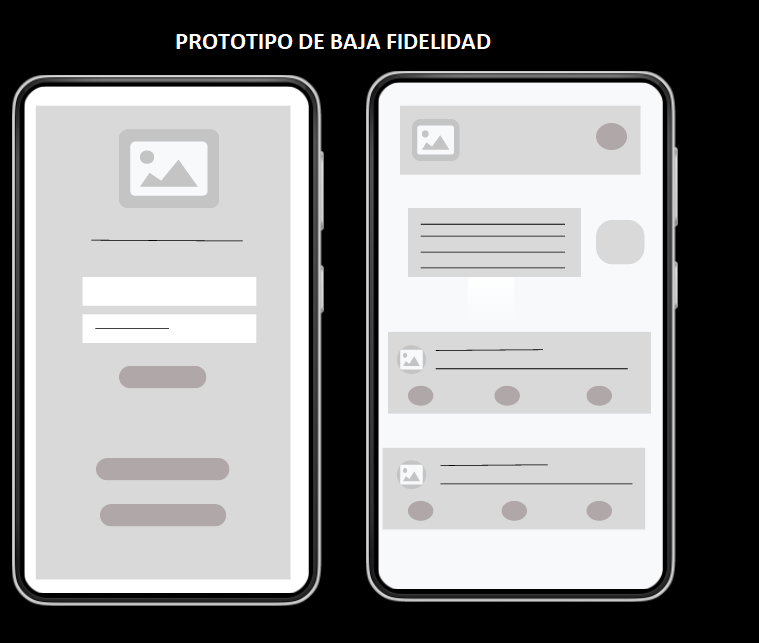
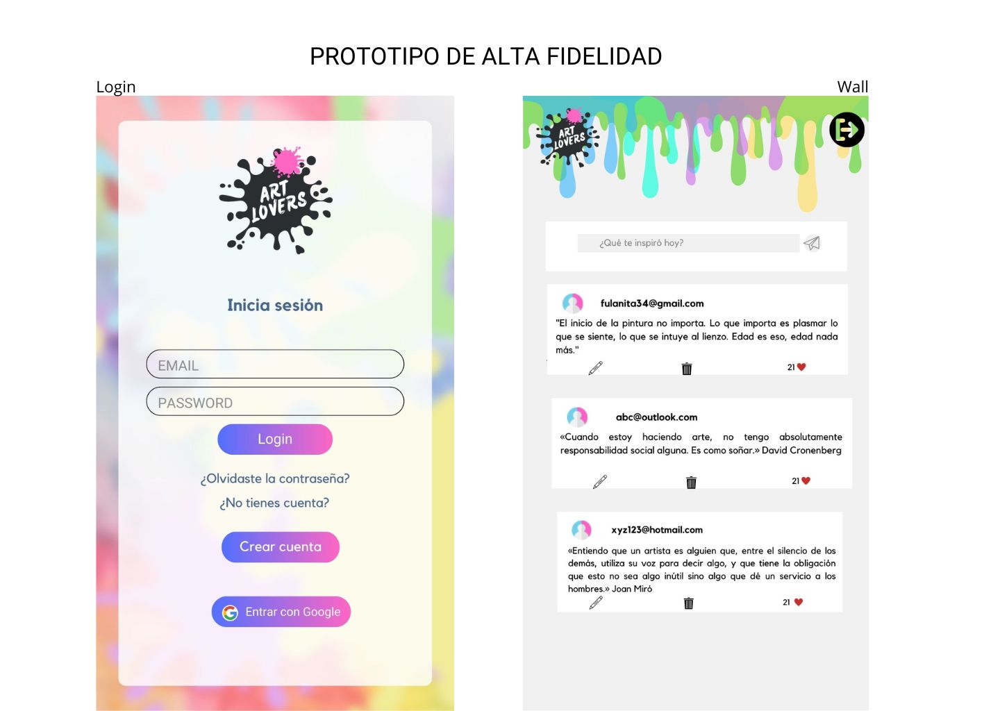
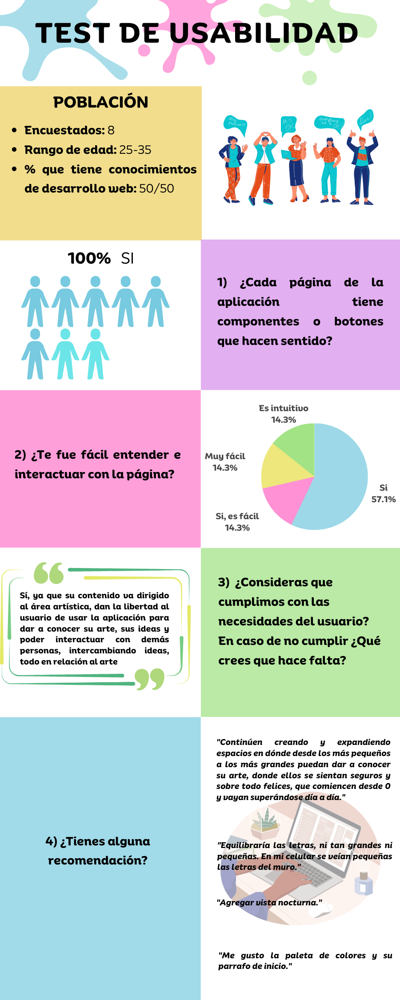

# Art Lovers 

Link Proyecto: [Ir a la Página Web](https://art-lovers-6da8d.web.app)

## Índice

* [1. Definición del producto.](#1-definicion-del-producto)
* [2. Herramientas utilizadas.](#2-herramientas-utilizadas)
* [3. Historias de usuario.](#3-historias-de-usuario)
* [4. Prototipos.](#4-prototipos)
* [5. Interfaz.](#5-interfaz)

## 1. Definición del producto.

Art Lovers, es una red social para la comunidad de artistas y apasionados por el arte y el dibujo. 
Teniendo en cuenta la importancia de emplear el arte para expresar sentimientos, emociones, ser mas feliz, 
entre otros pues produce un aumento de la autoestima y la resiliencia, en nuestra red social el usuario podra 
compartir tips, comentarios, informacion practica para artistas en proceso, motivacion y sugerencias con 
respecto al arte.

- **¿Quiénes son los principales usuarios de producto?** 
Artistas amateur, personas del comun que buscan refugio en el arte, artistas profesionales y apasionados por el arte.

- **¿Qué problema resuelve el producto?** 
Este producto fue creado con el fin de dar un espacio seguro a personas que les apasiona alguna rama del arte y pueden compartir con la 
comunidad sus inquietudes, sugerencias, comentarios, tips entre otros para como comunidad apoyarse y desahogarse del dia a dia de manera 
artistica.

## 2. Herramientas utilizadas.

  - **GitHub projects**: Organización de equipo. 
  - **Figma**: Crear prototipos.
  - **Google Forms**: Formulario con preguntas para el test de 
  usabilidad.
  - **HTML**: Dar estructura a la interfaz.
  - **CSS**: Para dar estilo a la interfaz.
  - **Javascript**: Para dar funcionalidad a la aplicación.
  - **Jest**: Pruebas unitarias de las funciones implementadas 
  en javascript. 
  - **Firebase**: Es una plataforma en la nube para el desarrollo de aplicaciones web y móvil.
 
## 3. Historias de usuario.

Según la necesidad de los usuarios y entendiendo lo que  querían evidenciar en el sitio, realizamos 4 
historias:
 ### 3.1 Primera historia de usuario 
- **Yo como**: Dibujante amateur
- **Quiero**: Registrarme a una red social de una comunidad de artistas
- **Para**: Conocer a más personas con el mismo hobbie.

**Criterios de aceptación.**

- Crear cuenta de usuario.

**Definición de terminado.**

- Single App Page
- Uso de Firebase para la validación de usuarios mediante correo electrónico de verificación.
- Aplicar la técnica mobile first
- Prototipo de alta y baja fidelidad
- Tests de usabilidad con feedback de los usuarios
- Tests unitarios
Reflexiona y luego marca los objetivos que has llegado a entender y aplicar en tu proyecto. Piensa en eso al 
decidir tu estrategia de trabajo.
#### 3.1.1 Historia de usuario 
- **Yo como**: Apasionado por el arte
- **Quiero**: Reestablecer mi contraseña
- **Para**: Poder ingresar al aplicativo cuando se me olvide la clave.

**Criterios de aceptación.**
- Función que me permita reestablecer mi contraseña.

**Definición de terminado.**
- Input de de email.
- Botón de enviar el correo.
- Al usuario le llegue el correo para reestablecer la contraseña.
- Test unitarios.
#### 3.1.2 Historia de usuario
- **Yo como**: Artista
- **Quiero**: Iniciar sesión usando mi cuenta de google
- **Para**: Poder conocer mas artistas.

**Criterios de aceptación.**

- Función con firebase que permita crear usuario con el correo y datos de Google.

**Definición de terminado.**

- Botón de iniciar sesión con google.
- Uso de Firebase para la validación de usuarios.
- Funcionalidad de la ventana emergente para crear usuario.

 ### 3.2 Segunda historia de usuario
- **Yo como**: Aprendiz de dibujante
- **Quiero**: Iniciar sesión con mi correo y contraseña
- **Para**: Poder ingresar al aplicativo.

**Criterios de aceptación.**

- Función que me permita iniciar sesión.

**Definición de terminado.**

- Input de de email y password.
- Botón de iniciar sesión.
- Router hacia la pagina del muro.
- Prototipos y tests.

### 3.3 Tercera historia de usuario
- **Yo como**: Aficionada al mundo del arte
- **Quiero**: Poder subir texto a la red social
- **Para**: Compartir ideas, opiniones o tips a otras personas con quienes comparto intereses.

**Criterios de aceptación.**
- Caja de texto que me permita escribir y publicar en cualquier momento.

**Definición de terminado**.
- Diseño de la caja de texto.
- Input tipo texto.
- Despliegue del comentario en el feed.
- Prototipos de alta y baja fidelidad.
- Tests de usabilidad

### 3.4 Cuarta historia de usuario
- **Yo como**: Parte de una comunidad de artistas y apasionados por el arte
- **Quiero**: Poder recibir y dejar comentarios y likes de las publicaciones
- **Para**: Saber qué contenido le gusta más a mis seguidores y poder encaminar mi contenido.

**Criterios de aceptación.**

- Botón de “me gusta” y botón para escribir comentarios.

**Definición de terminado.**

- Botón de “me gusta”
- Botón que abra un input text donde permita dejar comentarios
- CSS. Despliegue de los comentarios y que se deslice el contenido de la página hacia abajo.

## 4. Prototipos.

- **Prototipo de baja fidelidad**
Realizamos prototipo de baja fidelidad en [Figma](https://www.figma.com/file/C1OkOIqAtKNwY2QRlUsk7h/Untitled?type=design&node-id=0-1&mode=design&t=KQJz0efkNmfV5Oil-0). 
- **Prototipo de alta fidelidad**
Realizamos prototipo de alta fidelidad en [Figma](https://www.figma.com/file/BnTs3ddeGVDaI4mfvgS3bR/Untitled?type=design&node-id=0-1&mode=design&t=ChsilpL0sUnPzrwQ-0).  para difetentes dispositivos.

### 4.1 . Test de usabilidad de prototipos.
Realizamos el test de usabilidad desde los prototipos para las historias de usuario y estos fueron los 
resultados:

Teniendo en cuenta los resultados del test de usabilidad, se llegó a la conclusión de que era necesario dar estilo mas adecuado al tipo de letra y tamaño. 

## 5. Interfaz.
En la interfaz, el usuario puede interactuar con las diferentes paginas para iniciar sesion, crear usuario, reestablecer contraseña e ingresar con el correo de google, al ingresar al aplicativo puede postear, editar o borrar comentarios, dar like y ver el contador de los mismos. 
